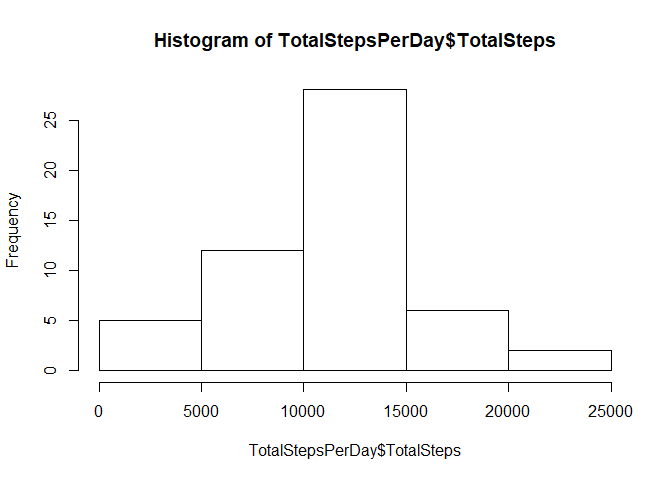
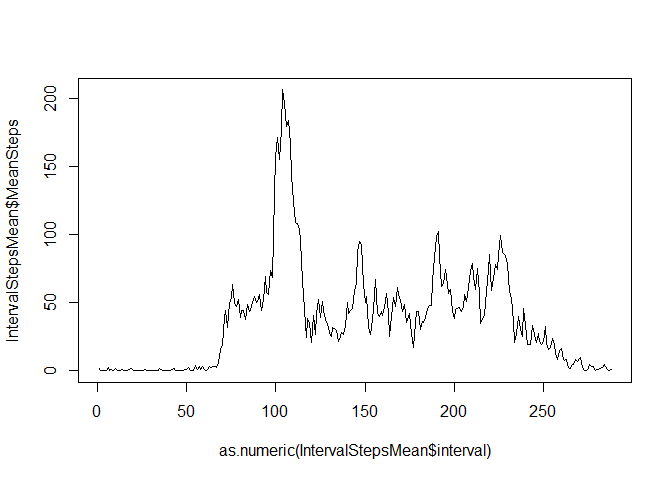
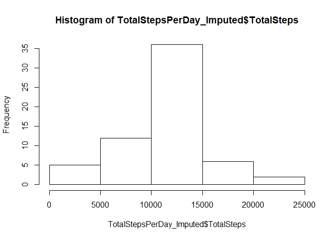
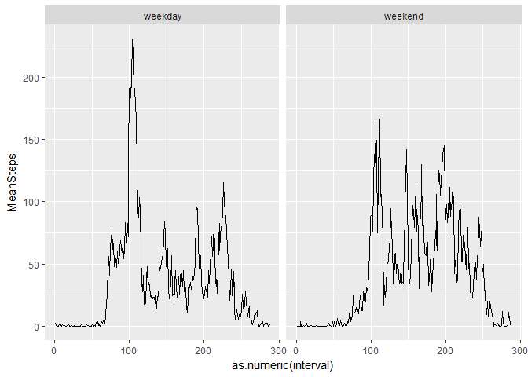

#### Loading the necessary libraries 


```r
library(caret)
```

```
## Warning: package 'caret' was built under R version 3.5.1
```

```r
library(ggplot2)
library(plyr)
library(dplyr)
library(stringr)
```

<br>
<br>


### Loading and preprocessing the data


#### Loading the data to memory and doing the necessary format changes  


```r
Activity <- read.csv("C:/Data Science/John Hopkins - Coursera/Reproducible Research/Assignment 1/activity.csv")
Activity$date <- as.character(Activity$date)
Activity$date <- as.factor(Activity$date)
```


<br>
<br>


#### What is mean total number of steps taken per day?


```r
TotalStepsPerDay <- Activity %>% group_by(date) %>% summarise(TotalSteps = sum(steps))
head(TotalStepsPerDay , 10)
```

```
## # A tibble: 10 x 2
##    date       TotalSteps
##    <fct>           <int>
##  1 2012-10-01         NA
##  2 2012-10-02        126
##  3 2012-10-03      11352
##  4 2012-10-04      12116
##  5 2012-10-05      13294
##  6 2012-10-06      15420
##  7 2012-10-07      11015
##  8 2012-10-08         NA
##  9 2012-10-09      12811
## 10 2012-10-10       9900
```

<br>
<br>


#### Histogram of steps taken per day 


```r
hist(TotalStepsPerDay$TotalSteps)
```

<!-- -->


#### Mean and Median of total steps per day


```r
meanTotalSteps <- mean(TotalStepsPerDay$TotalSteps , na.rm = TRUE)
meanTotalSteps
```

```
## [1] 10766.19
```

```r
medianTotalSteps <- median(TotalStepsPerDay$TotalSteps , na.rm = TRUE)
medianTotalSteps
```

```
## [1] 10765
```

<br>
<br>


### What is the average daily activity pattern?


#### Time series plot


```r
Activity$interval <- as.factor(Activity$interval)

IntervalStepsMean <- Activity %>% group_by(interval) %>% summarise(MeanSteps=mean(steps , na.rm = TRUE))

plot(as.numeric( IntervalStepsMean$interval)  , IntervalStepsMean$MeanSteps , type="l")
```

<!-- -->

<br>
<br>

#### Which 5-minute interval, on average across all the days in the dataset, contains the maximum number of steps?


```r
MostActiveInterval <- IntervalStepsMean[order(IntervalStepsMean$MeanSteps , decreasing = TRUE),]$interval [1]

as.numeric(as.character(MostActiveInterval))
```

```
## [1] 835
```

<br>
<br>

### Imputing Missing Values 

<br>

#### Calculate and report the total number of missing values in the dataset 


```r
nrow(Activity[ which(is.na(Activity$steps)) , ])
```

```
## [1] 2304
```

<br>
<br>

#### Filling in the missing values and creating a new dataset that is equal to the original dataset but with the missing data filled in.


```r
MissingValueIndices <- which(is.na(Activity$steps))


Activity_MissingImputed <- Activity


for( i in MissingValueIndices)
{
  
  Activity_MissingImputed[i , "steps"] <- inner_join(Activity[i, ] , IntervalStepsMean , by = 'interval')$MeanSteps
  
  
}
```


<br>
<br>

### Histogram of total number of steps each day after imputation 


```r
TotalStepsPerDay_Imputed <- Activity_MissingImputed %>% group_by(date) %>% summarise(TotalSteps = sum(steps))

hist(TotalStepsPerDay_Imputed$TotalSteps)
```

<!-- -->

```r
meanTotalSteps_Imputed <- mean(TotalStepsPerDay_Imputed$TotalSteps , na.rm = TRUE)

medianTotalSteps_Imputed <- median(TotalStepsPerDay_Imputed$TotalSteps , na.rm = TRUE)
```


#### Mean and Median of total steps each day after imputation 


```r
meanTotalSteps_Imputed
```

```
## [1] 10766.19
```

```r
medianTotalSteps_Imputed
```

```
## [1] 10766.19
```


#### Impact of Mean and Median after imputation 


```r
meanTotalSteps - meanTotalSteps_Imputed
```

```
## [1] 0
```

```r
medianTotalSteps - medianTotalSteps_Imputed
```

```
## [1] -1.188679
```

#### Since I had used the interval wise mean for imputing , there is no impact on the mean. Howeever, there is a small difference in the median 

<br>
<br>


### Are there differences in activity patterns between weekdays and weekends?


#### Creating a new feature indicating Weekday or Weekend 


```r
Activity_MissingImputed$date <- as.character(Activity_MissingImputed$date)

Activity_MissingImputed$date <- as.Date(Activity_MissingImputed$date)

Activity_MissingImputed$DayOfWeek <- weekdays(Activity_MissingImputed$date )


Activity_MissingImputed$WeekendFlag <- NA

Activity_MissingImputed$WeekendFlag <- as.character(Activity_MissingImputed$WeekendFlag)

Activity_MissingImputed[which(Activity_MissingImputed$DayOfWeek == "Saturday") , ]$WeekendFlag <- "weekend"

Activity_MissingImputed[which(Activity_MissingImputed$DayOfWeek == "Sunday") , ]$WeekendFlag <- "weekend"

Activity_MissingImputed[which(is.na(Activity_MissingImputed$WeekendFlag)) , ]$WeekendFlag <- "weekday"

Activity_MissingImputed$WeekendFlag <- as.factor(Activity_MissingImputed$WeekendFlag)
```

#### Plot to check if there is an difference in activity levels  between Weekday and weekend


```r
IntervalStepsMean_WeekDay <- Activity_MissingImputed %>% group_by(WeekendFlag , interval) %>% summarise(MeanSteps=mean(steps , na.rm = TRUE))


ggplot(data=IntervalStepsMean_WeekDay , mapping = aes(as.numeric(interval) , MeanSteps)) + geom_line()+
                                            facet_wrap( ~ WeekendFlag)
```

<!-- -->


